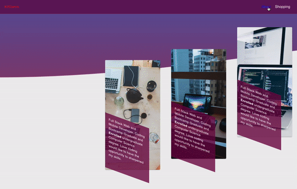

 
 

### Hi there 👋, I'm Wilkenson, 
##### < 👨🏾‍💻 let's connect & build stuffs 😁 />

🏅Coding bootcamp graduate

👨🏾‍💻Computer science major (in progress)

📚Student ---> always learning

👾Eager to learn & technically inquisitive

䷐Let's connect and talk tech

####   
 
 ### Examples of work
  &nbsp; &nbsp;&nbsp;&nbsp;&nbsp;&nbsp; &nbsp;&nbsp;&nbsp;&nbsp;
 <a href="https://github.com/wilkensoncode/commerce">👾<small>ViewRepo</small></a>🗂
 &nbsp; &nbsp;&nbsp;&nbsp;&nbsp;&nbsp; &nbsp;&nbsp;&nbsp;&nbsp;&nbsp;
 &nbsp;&nbsp;&nbsp;&nbsp;&nbsp; &nbsp;&nbsp;&nbsp;&nbsp;
 <a href="https://github.com/wilkensoncode/portfolio">👾<small>ViewRepo</small></a>🗂
 

 &nbsp; &nbsp;&nbsp;
  

 
  
  
### Github stats

    
  

### Let' connect

 

### Skills:

 

 
<a href="https://reactjs.org/" target="_blank" rel="noreferrer"> 
  
</a> 

 
 
  
 

 
